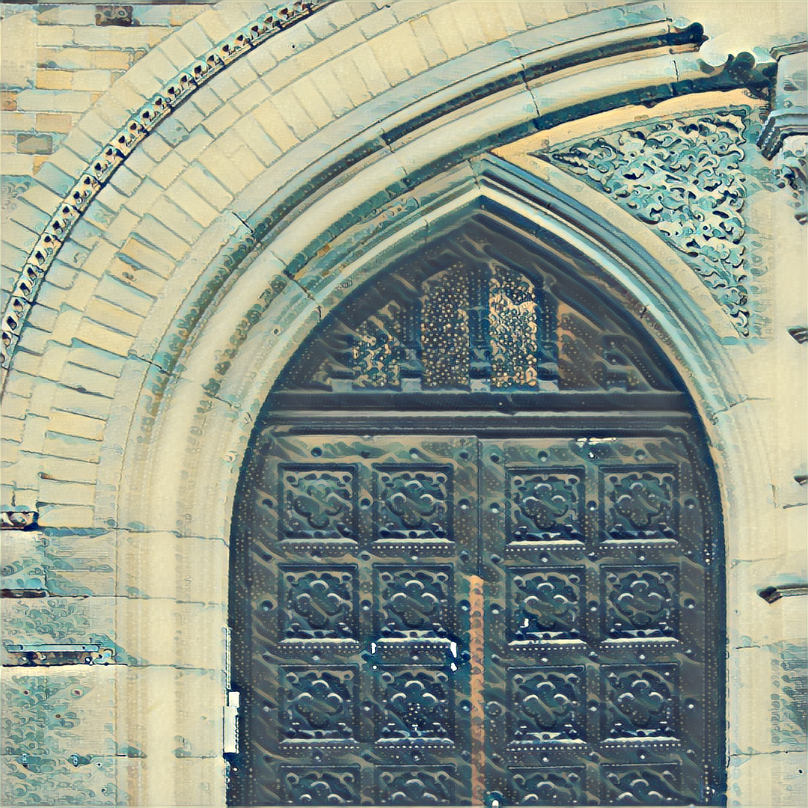
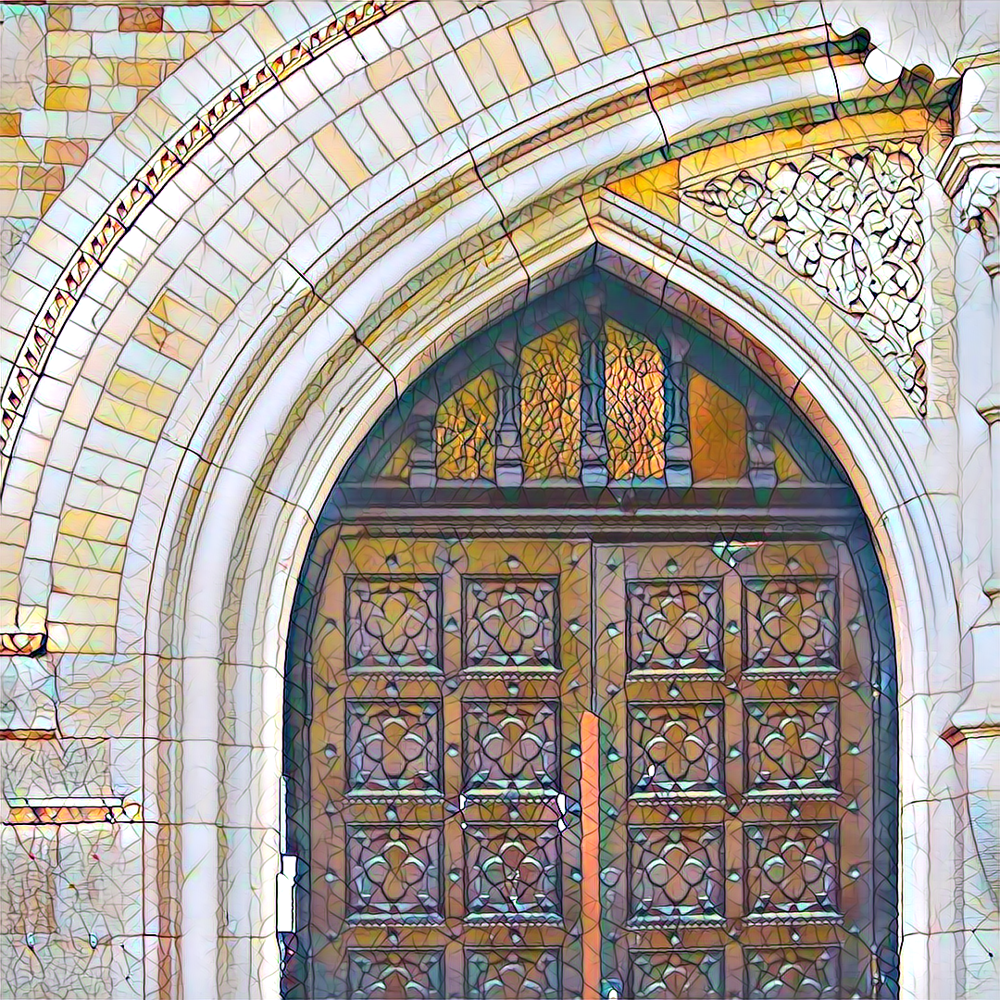
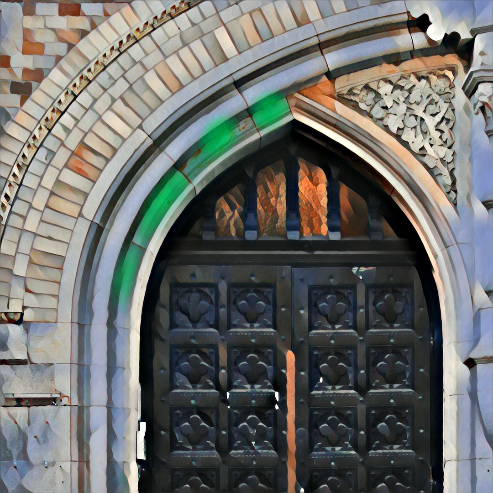

# Fast Style Transfer

Tensorflow 2 implementation of Fast Style Transfer which merges the style of one picture with the content of another.

The algorithm is based on [Perceptual Losses for Real-Time Style Transfer and Super-Resolution](https://arxiv.org/abs/1603.08155) 
with the addition of [Instance Normalization](https://arxiv.org/pdf/1607.08022.pdf).

<p align="center">
    
    
    
</p>

## Requirements

Create a Python 3.7 virtual environment and activate it:

```bash
virtualenv -p python3.7 venv
source ./venv/bin/activate
```

Next, install the required dependencies:

```bash
pip install -r requirements.txt
```

## Usage

To style an image using a pre-trained model specify the input and output image paths and the log directory containing model checkpoints.

### Style image

```bash
python style.py \
    --image-path images/content/amber.jpg \
    --log-dir models/mosaic/lr=0.001_bs=16_sw=10.0_cw=10.0/ \
    --output-path images/output/output-image.png
```

### Train model

```bash
python train.py \
    --log-dir models/mosaic/ \
    --style-image images/style/mosaic.jpg \
    --test-image images/content/amber.jpg
```

Training, which uses the COCO 2014 train dataset, takes about 1-2 hours on a Tesla P100 GPU.

To track metrics, start `Tensorboard`

```bash
tensorboard --logdir models/
```

and navigate to [localhost:6006](localhost:6006).

## Example models

<div align="center">
  		
</div>

<div align="center">
  
  
  
  
  <br>
  
  
  
  
</div>

